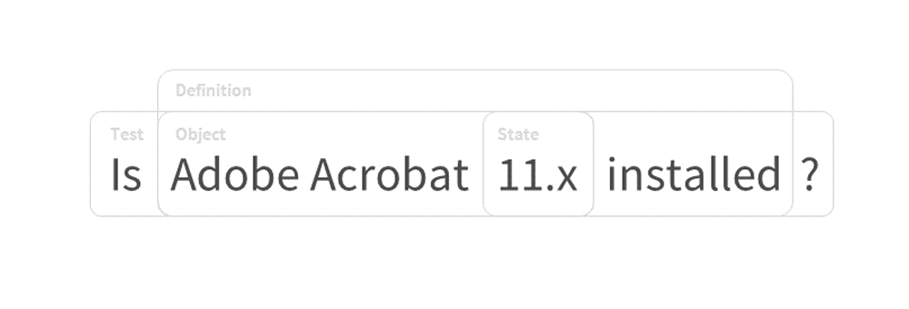
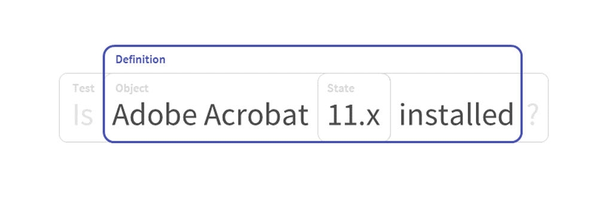
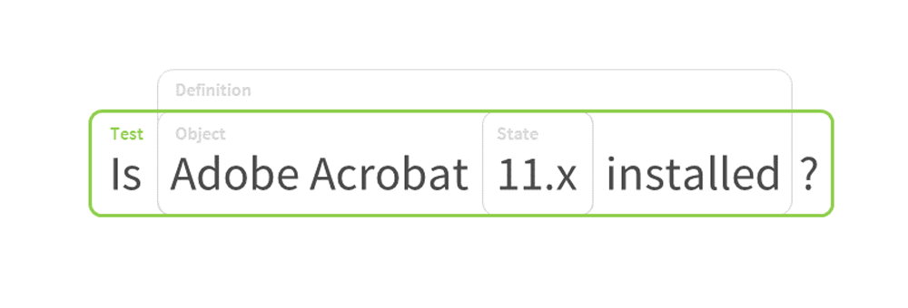
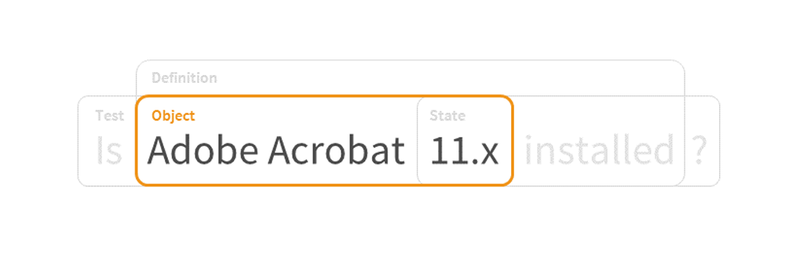
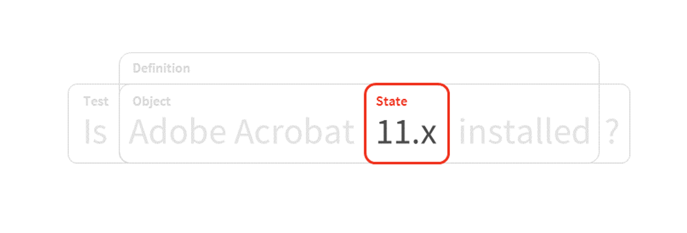

.. _getting-started:

Getting Started
===============

Are you new to OVAL? Wondering what it is and how it's used? Read on!

What is OVAL?
-------------

OVAL is an open, standardized assertion language written in XML that standardizes how to assess and report on the machine state of computer systems. Used by the U.S. Government, the Center for Internet Security, Cisco, and McAfee, among many others, it is the most mature and widely adopted open source standard for security assessment. With the goal of easing interoperability between security tools, it includes content for vulnerability assessment, configuration management, system inventory, and patch management. Security experts, system administrators, and software developers from industry, government, and academia have collaborated to write OVAL, and this consensus is one of its greatest attributes.

Anyone can write OVAL, and we always welcome new contributors.

OVAL Use Cases
--------------

OVAL is primarily used for assessing vulnerabilities in security configurations. OVAL content can also be used in other ways, documented in the `Use Cases <http://oval-community-guidelines.readthedocs.io/en/latest/oval-design-principles.html#oval-use-cases>`_.

OVAL Structure
--------------

OVAL can be broken down into a series of components that together represent a check, validation, or idea. This can generally be expressed as a prose sentence:

|Prose|
^^^^^^^^^^^^^

This is expressed as a definition, which references or includes the other components as seen below.

|Definitions|
^^^^^^^^^^^^^

definitions
  Definitions are specifications of what endpoint information should be checked and what corresponding values are expected to be found, as well as how to interpret the results of that comparison. They comprise one or more tests, which taken together represent an externally meaningful datum, such as a vulnerability state or inventory status.
|

|Tests|
^^^^^^^

tests
  Tests are the concrete building blocks of definitions. They specify the relationship between an OVAL Object and zero or more OVAL States, matching the information to be collected with the corresponding values expected to be found.
|

|Objects|
^^^^^^^^^

objects
  Objects define what should be collected from an endpoint.

  *A concrete OVAL Object may define a set of 0 or more OVAL Behaviors. OVAL Behaviors are actions that can further specify the set of OVAL Items that match an OVAL Object.*
|

|States|
^^^^^^^^

states
  States are the expected values from an object that are compared to the information collected from an endpoint.
|

variables
  Variables provide a way to group one or more values for consistent reference within other OVAL content.
|

An Annotated Sample
-------------------

Below is a sample OVAL definition file::

  <?xml version="1.0" encoding="UTF-8"?>
  <oval_definitions xmlns="http://oval.mitre.org/XMLSchema/oval-definitions-5" xmlns:oval="http://oval.mitre.org/XMLSchema/oval-common-5" xmlns:xsi="http://www.w3.org/2001/XMLSchema-instance" xsi:schemaLocation="http://oval.mitre.org/XMLSchema/oval-common-5 oval-common-schema.xsd http://oval.mitre.org/XMLSchema/oval-definitions-5 oval-definitions-schema.xsd">
  <generator>
  <!--
  The generator element provides metadata about the tool/application used to develop the OVAL Content.
  -->
  <oval:schema_version>5.11.2</oval:schema_version>
  <oval:timestamp>2018-07-31T17:30:20</oval:timestamp>
  </generator>

  <definitions>
   <!--
   The definitions element contains the OVAL definition(s) to be exchanged.
   -->
   <definition class="compliance" id="oval:org.oval-community.example:def:1" version="1">
   <!--
   This definition checks compliance.
   -->
      <metadata>
         <!--
         The metadata element contains information about the definition, including its title and description. This definition checks whether WinRM traffic is encrypted or not.
         -->
            <title>WinRM Traffic Must be Encrypted</title>
            <affected family="windows">
               <platform>Microsoft Windows Server 2016</platform>
            </affected>
         <reference ref_id="CCE-46378-6" ref_url="http://cce.mitre.org" source="CCE"/>
         <description>The Windows Remote Management (WinRM) client must not allow unencrypted traffic.</description>
      </metadata>
   <notes>
   <note>This sample was based on an OVAL definition included in the Windows Server 2016 STIG available at https://iase.disa.mil/ </note>
   </notes>
   criteria operator="AND">
      <!--
      The criteria element specifies the assertion to be tested using information gathered from the endpoint.
      -->
         <criterion comment="Verifies 'WinRM Client: Allow unencrypted traffic' is set to 'Disabled'" test_ref="oval:org.oval-community.example:tst:1"/>\
            <!--
            The criterion elements define logical terms in the assertion. This criteria only uses 1 criterion element to check if 'WinRM Client: Allow unencrypted traffic' is set to 'Disabled'.

            By default, the truth values returned by the tests are AND'ed to determine the truth value of the assertion.
            -->
      </criteria>
   </definition>
  </definitions>

  <tests>
   <!--
   The tests element contains the OVAL Test(s). OVAL Tests specify what to search for on an endpoint (i.e., objects) and what is expected to be found (i.e., states).

   The registry_test is used to check information in the Windows registry.
   -->
      <registry_test check="all" check_existence="at_least_one_exists" comment="WinRM Client: Allow unencrypted traffic is set to 'Disabled'" id="oval:org.oval-community.example:tst:1" version="1" xmlns="http://oval.mitre.org/XMLSchema/oval-definitions-5#windows">
         <!--
         This registry_test checks that 'Allow unencrypted traffic' is set to 'Disabled'.
         -->
         <object object_ref="oval:org.oval-community.example:obj:1"/>
         <state state_ref="oval:org.oval-community.example:ste:1"/>
      </registry_test>
  </tests>

  <objects>
   <!--
   The objects element contains the OVAL Object(s).

   The registry_object is used to search for information in the Windows registry.
   -->
      <registry_object comment="WinRM Cl ient: AllowUnencryptedTraffic registry key" id="oval:org.oval-community.example:obj:1" version="1" xmlns="http://oval.mitre.org/XMLSchema/oval-definitions-5#windows">
         <!--
         This registry_object specifies that the registry key containing the policy definition for 'WinRM Client: Allow unencrypted traffic' should be checked.
         -->
            <hive datatype="string" operation="equals">HKEY_LOCAL_MACHINE</hive>
            <key datatype="string" operation="equals">Software\Policies\Microsoft\Windows\WinRM\Client</key>
            <name datatype="string" operation="equals">AllowUnencryptedTraffic</name>
      </registry_object>
  </objects>

  <states>
   <!--
   The states element contains the OVAL State(s).

   The registry_state is used to describe information expected to be found in the Windows registry.
   -->
      <registry_state comment="Reg_Dword equals 0" id="oval:org.oval-community.example:ste:1" version="1" xmlns="http://oval.mitre.org/XMLSchema/oval-definitions-5#windows">
         <type>reg_dword</type>
            <!--
            This registry_state specifies that an integer matching '0' is expected to be found in the registry.
            -->
         <value datatype="int" operation="equals">0</value>
      </registry_state>
  </states>

  </oval_definitions>

OVAL Features
-------------

* XML- and assertion-based language 
* implementation-neutral, semantic content authoring
* enables enforcement of script-free, read-only policy
* supports content reuse
* complex first order logic
* variables in a variety of functions for string manipulation
* supports technology-neutral policy authoring
* extensible
* supports trust management through digital signatures and verifications
* automatically checkable for conformance with standard
* brings consistency and transparency to the results produced by security scanning tools
* assists in the exchange of machine-readable information between security tools
* reduces the need for IT Security Professionals to learn the proprietary languages of each of their tools

**Use OVAL to:**

* make implementation-neutral assertions about platforms and their machine states (e.g. files, registry keys, etc.)
* express policy content without defining implementation method

The OVAL Schemas
----------------

OVAL comprises a set of schemas, which correspond to unique Models that establish the logical framework for making assertions about the posture of an endpoint. The Models provide the building blocks for representing the expected and actual states of endpoints and the results of the comparison of those elements.

There are two main sets of schemas: Core and Platform Extensions. The Core Schemas form the foundation of the language, while Platform Extensions extend the Core Schemas to support different platforms, such as Windows, Linux, and Cisco IOS.

Related Standards
-----------------

XCCDF
  The `eXtensible Configuration Checklist Description Format <https://csrc.nist.gov/projects/security-content-automation-protocol/scap-specifications/xccdf>`_ language describes security checklists. Documents in this format may reference OVAL components or documents, as well as ones from other standards, creating a portable and flexible checklist.
|

SCE
  The `Script Check Engine <https://www.open-scap.org/features/other-standards/sce/>`_ complements OVAL with scripts that check things that OVAL cannot or does not. SCE results files are created as an XML. By using XLST transformations, OVAL and SCE results can be aggregated into a single HTML file or PDF document.
|

CPE
  The `Common Platform Enumeration <https://cpe.mitre.org/specification/>`_ provides a standard naming scheme for IT platforms and systems. OVAL uses it to consistently identify the target platforms of checks and definitions.
|

Datastreams
  **Datastream** is a format that consolidates multiple SCAP components into a single file (including OVAL).

  **ARF**, or the **Asset Reporting Format**, is also called Result Datastream. It consolidates multiple results files into one.
|

Next Steps
----------

* `Additional Resources <http://oval-community-guidelines.readthedocs.io/en/latest/additional-resources.html>`_
