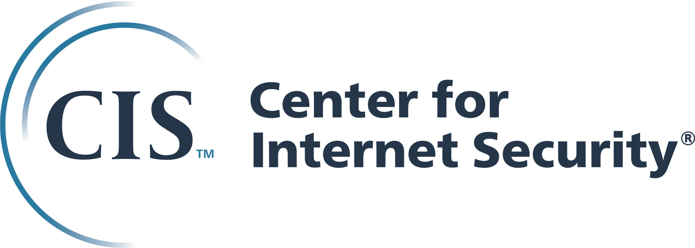

.. _oval-content-repositories:

OVAL Content Repositories
=========================

Intro tbd.

Repositories
------------

Below is a list of additional known OVAL repositories.

|ALTEX-SOFT|
^^^^^^^^^^^^

The ALTEX-SOFT repository OVALdb consist of OVAL Definitions that correspond to security advisories/notices/bulletins/compliances for a lot of software vendors. This repository contains OVAL definitions for vulnerabilities, patches, compliances and inventories.

`Click here for the ALTEX-SOFT Repository <http://www.ovaldb.altx-soft.ru/>`_

|Ubuntu|
^^^^^^^^

This page provides OVAL xml content for the latest Ubuntu operating system versions.

`Click here for the Ubuntu Repository <https://people.canonical.com/~ubuntu-security/oval/>`_

|CIS|
^^^^^^^^^^^^^^^^^^^^^^^^^^^^

The CIS repository is the new official OVAL Repository following the transition away from MITRE. Created August 2015.

`Click here for the CIS Repository <https://oval.cisecurity.org/repository>`_

|Cisco|
^^^^^^^

The Cisco Security Intelligence Operations repository consists of Cisco security advisories in the standardized Common Vulnerability Reporting Format (CVRF) and includes OVAL Vulnerability Definitions for the Cisco IOS security advisories. Created September 2012.

`Click here for the Cisco Repository <https://tools.cisco.com/security/center/publicationListing.x>`_

|Debian|
^^^^^^^^

The Debian repository of OVAL content consists of OVAL Definitions that correspond to Debian security advisories. Created August 2010.

`Click here for the Debian Repository <https://www.debian.org/security/oval/>`_

Defense Information Systems Agency Field Security Operations (DISA FSO)
^^^^^^^^^^^^^^^^^^^^^^^^^^^^^^^^^^^^^^^^^^^^^^^^^^^^^^^^^^^^^^^^^^^^^^^
A repository of Security Technical Implementation Guides (STIGs) in support of Security Content Automation Protocol (SCAP) content and tools. Created: May 2012.

`Click here for the DISA FSO Repository <http://iase.disa.mil/stigs/scap/index.html>`_

IT Security Database
^^^^^^^^^^^^^^^^^^^^
This site collects OVAL Definitions from sources such as the OVAL Repository, Red Hat, Suse, NVD, Apache, etc., and provides a unified, easy-to-use Web interface to all IT security related items about them including patches, vulnerabilities, and compliance checklists. Created: November 2010.

`Click here for the IT Security Database Repository <http://www.itsecdb.com/oval>`_

|SCAP|
^^^^^^^

The Security Content Automation Program (SCAP) is a public free repository of security content to be used for automating technical control compliance activities, vulnerability checking (both application misconfigurations and software flaws), and security measurement. Created January 2007.

`Click here for the NIST (SCAP) Repository <http://scap.nist.gov/content/>`_

|Positive Technologies|
^^^^^^^^^^^^^^^^^^^^^^^^

The Positive Technologies repository of OVAL content consists of OVAL Definitions collected from various sources. Created May 2012.

`Click here for the Positive Technologies Repository <http://oval.ptsecurity.com>`_

|RHEL|
^^^^^^^^^^^^^^^^^^^^^^^^

The Red Hat repository of OVAL content consists of OVAL Patch Definitions that correspond to Red Hat Errata security advisories. Created May 2006.

`Click here for the Red Hat Repository <https://www.redhat.com/security/data/oval/>`_

|SecPod|
^^^^^^^^

SecPod SCAP Feed, also hosted as a repository, is a service providing standardized SCAP content (CVE™, CPE™, CCE™, XCCDF, and OVAL®) for vulnerability, patch, inventory, and compliance management. Created December 2010.

`Click here for the SecPod Repository <https://www.scaprepo.com>`_

|Security Database|
^^^^^^^^^^^^^^^^^^^

This Web site provides a mirror of the OVAL Repository and links its Alerts to OVAL Definitions when possible. Created February 2012.

`Click here for the Security Database Repository <https://www.security-database.com/oval.php>`_

|SUSE|
^^^^^^^^^^^^^^^^^^^^^^^^^^^^

The SUSE Linux Enterprise OVAL Information database is an index of fixed security incidents indexed by product, RPM package name and version for use in security compliance checking. Created July 2010.

`Click here for the SUSE Repository <http://ftp.suse.com/pub/projects/security/oval/>`_

Updating the List
-----------------

To make changes to this list; to be added, removed, or have existing content modified, submit a pull request or email oval@cisecurity.org
